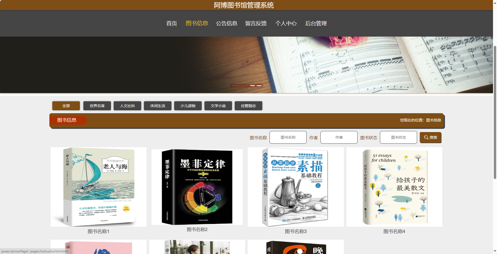
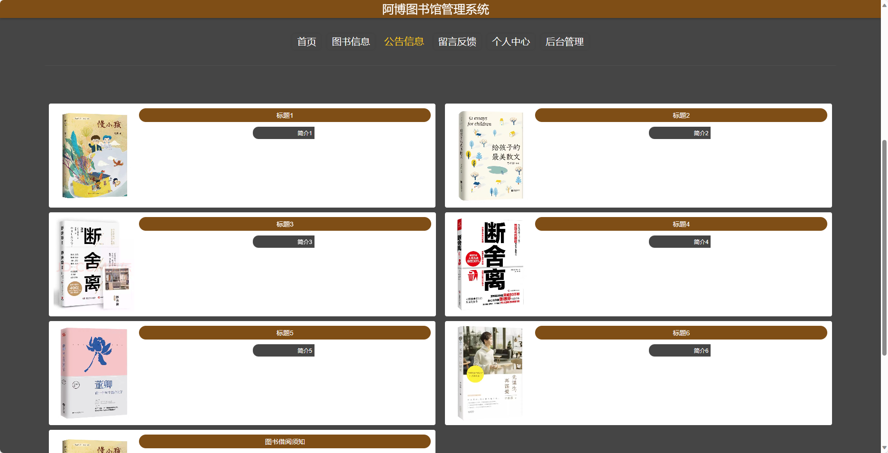
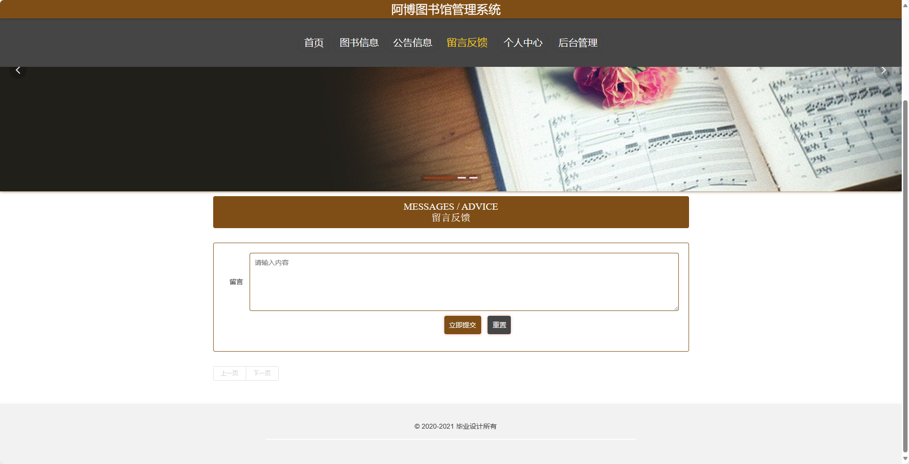
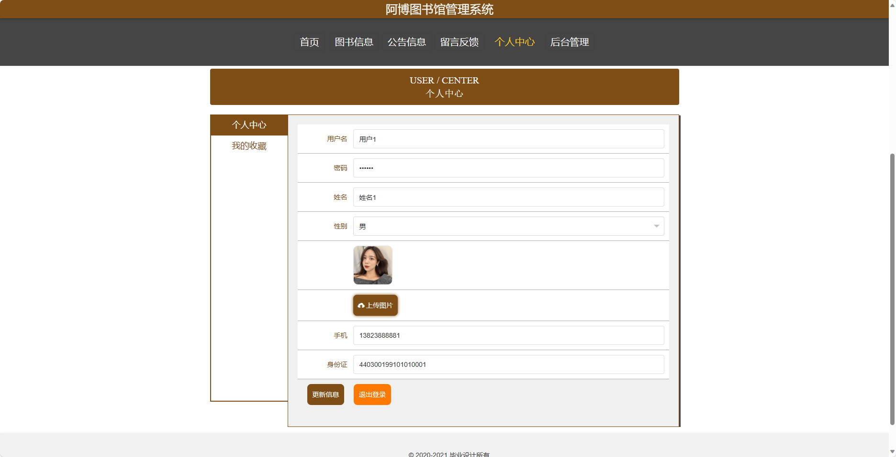
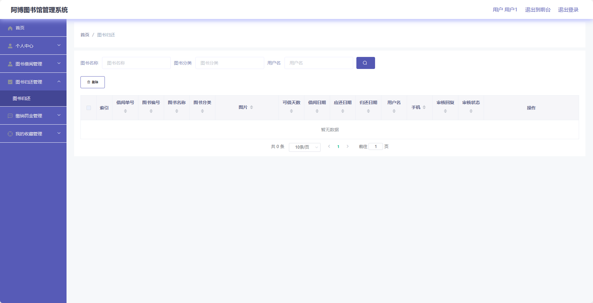

<h1 align="center">基于SpringBoot框架的图书馆管理系统【带文档】</h1>

<h4> 完整代码获取地址：从戎源码网（https://armycodes.com/） </h4>
<h4> 作者微信：19941326836 QQ：605739993 QQ群：655392706 </h4>
<h4> 承接计算机毕设、Java毕业设计、Python毕业设计、深度学习、机器学习 </h4>
<h4> 选题+开题报告+任务书+程序定制+安装调试+论文+答辩ppt 一条龙服务 </h4>
<h4> 毕业设计所有选题地址：(https://github.com/Descartes007/allProject) </h4>

## 项目介绍

基于SpringBoot框架的图书馆管理系统【带文档】：前端 vue、axios、elementui，后端 springboot、mybatis，系统角色分为：管理员和用户，管理员在管理后台用户信息、图书信息、图书归还管理等；用户可以借书和还书等。主要功能如下：

## 【前台】

- 首页：展示图书馆的基本信息，包括新书推荐、热门图书、图书馆开放时间等。
- 图书信息：提供用户浏览图书的功能，支持关键字搜索、查看图书详细信息、查看图书借阅情况等。
- 公告信息：展示图书馆的公告信息，包括图书馆活动、通知公告等。
- 留言反馈：提供用户反馈意见、建议的功能，支持留言、查看回复等。
- 个人中心：提供用户个人信息管理、密码修改、已借图书查询、收藏夹管理等功能。

## 【后台】
### 管理员

- 个人中心：提供管理员个人信息管理、密码修改等功能。
- 用户管理：支持管理员添加、删除用户、修改用户信息等。
- 图书分类管理：支持管理员添加、删除图书分类、修改图书分类信息等。
- 图书信息管理：支持管理员添加、删除图书、修改图书信息等。
- 图书借阅管理：支持管理员查看所有借阅记录、审核借阅请求等。
- 图书归还管理：支持管理员查看所有归还记录、处理罚款等。
- 缴纳罚金管理：支持管理员查看所有罚款记录、处理罚款等。
- 留言板管理：支持管理员查看用户留言、回复留言等。
- 系统管理：支持管理员配置系统基本参数、备份数据等操作。

### 用户

- 个人中心：提供用户个人信息管理、密码修改等功能。
- 图书借阅管理：支持用户借阅图书、查看借阅记录、续借图书等。
- 图书归还管理：支持用户归还图书、查看归还记录、缴纳罚金等。
- 缴纳罚金管理：支持用户在线缴纳罚金。
- 我的收藏管理：支持用户收藏图书、查看收藏夹等。

## 环境

- <b>IntelliJ IDEA 2020.3</b>

- <b>Mysql 5.7.26</b>

- <b>Maven 3.6.3</b>

- <b>JDK 1.8</b>

## 运行截图

